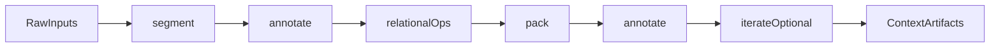

# Context DSL Foundation

## Thesis

Context engineering can be treated as declarative dataflow over **context units** rather than as a bag of prompt-specific chains. The smallest kernel that currently looks both expressive and defensible is:

- ordinary DataFrame algebra: `select`, `filter`, `join`, `groupby`, `agg`, `sort`, `limit`, `explode`, `union`, window functions, sinks
- new context primitives: `segment`, `annotate`, `pack`
- one extension primitive under real pressure: `iterate`

The narrow claim is **not** that LLM operators over tables are new. The narrower and more interesting claim is that **context construction, routing, compression, synthesis, and evaluation can be expressed as provenance-preserving, budget-aware DataFrame programs over context units**.



## Repo Evidence

The current repo already gives strong witness cases for the kernel:

- `pipelines/context_engineering/lambda_mapreduce.py`
  - cleanest proof that long-context reasoning patterns can stay inside the query plan
  - shows `segment` via page extraction, `annotate` via `prompt(...)`, and reduce/fold via ordinary `groupby().agg()`
- `pipelines/context_engineering/lambda_mapreduce_pdf_iceberg.py`
  - shows that multi-stage reduction can be materialized level by level without leaving the DataFrame execution model
- `pipelines/context_engineering/chunking_strategies.py`
  - shows multiple `segment` strategies plus embedding-style `annotate`
- `pipelines/context_engineering/few_shot_example_selection.py`
  - shows retrieval, reranking, selection, and prompt assembly as DataFrame-native operations
- `pipelines/context_engineering/arxiv_search/daily_workflow.py`
  - shows summarization, embedding, and indexing as retrieval-preparation steps that still fit the same dataflow model
- `pipelines/context_engineering/llm_judge_elo.py`
  - shows that pairwise judging fits the kernel, while global sequential rating is the clearest current breakpoint
- `pipelines/key_moments_extraction.py`
  - shows ordered time-aligned packing plus structured extraction, and exposes the boundary between context computation and effectful artifact production
- `datasets/common_crawl/text_deduplication.py`
  - very helpful because it turns `iterate` from a hypothetical extension into a concrete one
  - also introduces a second non-LLM family of context-adjacent operations: fingerprinting, blocking, clustering, and canonicalization

## Normalized Context Unit

The kernel becomes much clearer if every operator acts on a normalized row shape.

| Column | Meaning |
| --- | --- |
| `scope_id` | The current grouping scope: document, query, session, corpus, cluster, or frontier. |
| `unit_id` | Stable identifier for the unit produced by `segment` or later transforms. |
| `parent_unit_id` | Provenance link to the unit this row came from. |
| `source_id` | Original source object: file, page, audio file, message, retrieved record. |
| `modality` | `text`, `image`, `audio`, `json`, `vector`, or a higher-level semantic label. |
| `payload` | The actual content or structured object carried by the unit. |
| `order_key` | Position for stable ordering inside a scope. |
| `start_offset` / `end_offset` | Optional positional boundaries for spans, segments, timestamps, or windows. |
| `token_estimate` | Approximate size used by `pack` to enforce budgets. |
| `attrs` | Typed derived fields such as embedding, score, label, verdict, summary, or sketch. |

This does not mean every physical table must literally have all columns. It means the DSL should behave **as if** every operator is preserving or enriching that conceptual schema.

## Primitive Semantics

### `segment`

`segment` turns one row into zero or more rows while preserving provenance.

Typical strategies:

- page extraction from PDFs
- fixed-size windows with overlap
- sentence or paragraph boundaries
- heading-aware sections
- ASR transcript segments
- query expansion into subqueries

Required properties:

- stable `unit_id`
- preserved `parent_unit_id` and `source_id`
- explicit `order_key`
- deterministic or at least explicitly parameterized boundaries

### `annotate`

`annotate` adds typed columns to existing rows or grouped rows.

Typical uses:

- LLM generation or classification
- structured extraction
- embeddings or other vector features
- relevance scores
- fingerprints such as MinHash
- pairwise judgments

Design rule:

- `annotate` is the generic "oracle" primitive
- it may be implemented by an LLM, embedder, heuristic UDF, judge, or sketching function
- it should return typed data, not just anonymous strings

### `pack`

`pack` assembles rows into bounded context artifacts.

Typical uses:

- build the final prompt sent to a model
- select and order few-shot examples
- compress a retrieved set under a token cap
- merge partial summaries into one synthesis prompt
- assemble query-document-answer bundles for judging

Why `pack` is first-class:

- this is where context engineering differs from generic semantic operators
- the recurring problem is not merely "aggregate rows", but "assemble a budgeted, ordered, provenance-aware context artifact"
- the kernel gets much weaker if `pack` is reduced to ad hoc string joins
- the goal is to localize prompt assembly and bounded selection in one named place, not to pretend that all selection problems are equally easy

Expected outputs from `pack`:

- packed content
- packed unit ids
- packed token count
- optional dropped or overflow units

Scope note:

- `pack` should own ordering, templating, truncation, overlap-aware bundle construction, and simple greedy budget enforcement
- exact combinatorial subset optimization should remain outside the minimal kernel unless repeated coverage pressure forces promotion

### `iterate`

`iterate` is the only extension primitive currently justified by multiple independent examples.

Typical uses:

- hierarchical or refine-style summarization
- retrieve-read-requery loops
- fixed-point clustering or connected components
- multi-round memory compaction

Design rule:

- keep `iterate` narrow
- it should operate on tables and a step function, with `max_rounds` and `stop_when`
- it should not try to smuggle in arbitrary imperative control flow
- the implementation of `step_fn` may be imperative inside the engine, but the DSL surface should stay table-in, table-out
- awkward `iterate` cases such as MMR or bounded selector loops are acceptable only when state remains explicit, table-shaped, and locally recomputable from each round

Working form:

```text
iterate(state_tables, step_fn, stop_when, max_rounds)
```

## Kernel vs Sugar

Everything below should start as syntactic sugar unless coverage repeatedly forces promotion.

| Sugar | Desugars to |
| --- | --- |
| `chunk_fixed`, `chunk_sentences`, `chunk_paragraphs` | `segment` |
| `retrieve_dense` | `annotate(embed)` + similarity join/rank + relational top-k |
| `retrieve_hybrid` | multiple retrieval passes + `union` + fused `annotate(score)` |
| `select_examples` | `annotate(embed/score)` + rank + `pack` |
| `compress_context` | `annotate(importance)` + `filter/sort` + `pack` |
| `summarize_map_reduce` | `segment` + `annotate(summary)` + `pack` + `annotate(merge)` |
| `qa_synthesize` | retrieval + `annotate(answer)` + `pack` + `annotate(synthesize)` |
| `judge_pairwise` | pair construction + `pack` + `annotate(verdict)` |
| `vote_majority` | repeated `annotate` + `groupby/count` |
| `cluster_dedupe` | `annotate(sketch/embed)` + blocking/join + `iterate` |
| `memory_compact` | `segment(turns)` + `annotate(salience)` + `pack` + optional `iterate` |

The current evidence suggests a strong bias toward:

- a small kernel
- expressive sugar
- optimizer-aware desugaring

## Why `text_deduplication.py` Is Helpful

`datasets/common_crawl/text_deduplication.py` matters for three reasons:

1. It proves that a surprisingly rich fixed-point workflow can still be expressed mostly as DataFrame transforms.
2. It shows that not all context-engineering pressure comes from LLM calls; some pressure comes from similarity, blocking, canonicalization, and graph-like convergence.
3. It sharpens the boundary between **kernel** and **future sugar**:
   - `iterate` looks justified as a kernel extension
   - `sketch` / `block` / `canonicalize` look like future sugar families rather than core primitives

In other words, the file is useful not because deduplication is identical to prompt routing, but because it stress-tests the same declarative dataflow story.

## Coverage Summary

The companion matrix in `docs/context-dsl-coverage-matrix.md` evaluates 30 patterns.

- `22` patterns fit **cleanly**
- `7` patterns fit but are **awkward**
- `1` pattern is a real **break**

The recurring awkward themes are:

- semantic boundary detection over adjacency relations
- listwise or setwise scoring instead of row-wise annotation
- diversity-aware or submodular selection
- exact budgeted subset optimization
- source reconciliation and contrastive synthesis
- iterative frontier management in multi-hop workflows
- blocking and clustering for dedup or canonicalization

The recurring break is:

- **global sequential state** whose meaning depends on update order, best illustrated by ELO-style rating

That distinction matters: a bounded table-to-table loop is still within scope for `iterate`, while a single shared online accumulator whose value depends on event order is the current clean break.

## Breakpoint Taxonomy

| Breakpoint | Meaning | Current status |
| --- | --- | --- |
| Reference alignment | Outputs must snap back to an indexed segment stream or time grid. | Awkward, but still within `annotate` plus relational constraints. |
| Sketch / blocking | Similarity pipelines need fingerprints, banding, or approximate candidate generation. | Good candidate sugar family; no kernel promotion yet. |
| Graph / fixpoint | Convergence over relations, frontier growth, or connected components. | Justifies `iterate`, but not a separate graph kernel yet. |
| Global sequential state | One shared accumulator updated over an ordered event stream. | Current strongest break; do not force into the kernel. |
| Side effects and modality | Audio clipping, file writes, tool calls, or external actuation. | Explicitly outside a pure context DSL; keep as sinks/effects. |

Promotion rule:

- only promote a new primitive when **multiple unrelated algorithm families** fail for the same reason
- do not promote a primitive just because one benchmark is awkward

## Prior-Art Map

This table is a **desk review**, not a full literature review. The "Likely gap" column should be read as "not obviously first-class in the public APIs and docs reviewed here," not as a definitive claim that the capability is absent.

| System | What it already establishes | Overlap with this DSL | Likely gap relative to this DSL |
| --- | --- | --- | --- |
| LOTUS | DataFrame-like semantic operators such as `sem_filter`, `sem_map`, `sem_agg`, `sem_join`, `sem_topk` | Strong overlap on declarative AI operators over table-shaped data | Public docs do not obviously center first-class context packing, normalized context units, or agent-oriented context programs |
| Palimpzest | Declarative semantic operators over unstructured data with optimizer-driven physical execution | Strong overlap on lazy execution, optimization, and AI transforms over unstructured corpora | Public docs appear less centered on context construction as a standalone algebra and less explicit about budget-aware packing |
| Sema | SQL-native first-class LLM operators plus adaptive query execution | Strong overlap on optimizer story and on treating semantic operators as query-engine citizens | Public materials appear SQL-centric rather than context-centric, with no obvious first-class context-unit model or packing primitive |
| Snowflake Cortex AISQL | Production SQL functions such as `AI_FILTER`, `AI_AGG`, and `AI_SUMMARIZE_AGG` | Strong overlap on set-based AI operators and production execution | Public APIs appear function-centric rather than DSL-centric, with a weaker visible story around provenance, packing, and agent synthesis |
| Databricks AI functions | Native SQL access to summarization and model queries at scale | Shows the production category exists beyond research prototypes | Public APIs appear more function-oriented than algebra-oriented, with no strong visible context-engineering kernel claim |

## Narrow Novelty Claim

This is the version that seems defensible:

> Context engineering is a declarative, provenance-preserving, budget-aware dataflow problem over context units. A small kernel of DataFrame-native primitives - `segment`, `annotate`, `pack`, and optionally `iterate` - is sufficient to express most practical context-engineering algorithms, while preserving compatibility with lazy, distributed query execution.

More precise version:

> In the current 30-pattern coverage matrix, that kernel cleanly handles 22 patterns, awkwardly handles 7, and cleanly breaks on 1 pattern: classic online preference rating with global sequential state.

This is stronger than:

- "LLM operators on DataFrames"
- "semantic SQL exists"
- "map-reduce summarization exists"

It is also narrower, which is good.

## Experiment Agenda

### Phase 1: Prove the kernel in code

Prototype sugar on top of Daft for the highest-signal clean cases:

- `chunk_fixed`
- `chunk_sentences`
- `retrieve_dense`
- `retrieve_hybrid`
- `select_examples`
- `compress_context`
- `summarize_map_reduce`
- `qa_synthesize`
- `judge_pairwise`

### Phase 2: Measure coverage

For each pattern in `docs/context-dsl-coverage-matrix.md`:

- implement the desugaring against the same kernel
- record whether it stays fully inside the query plan
- record the first place where the abstraction becomes awkward

### Phase 3: Test the optimizer story

Measure whether the kernel actually inherits useful systems properties:

- batching
- lazy execution
- materialization at chosen boundaries
- cacheability
- distribution
- stable provenance through packing and reduction

### Phase 4: Test the agent-authoring story

Give an agent natural-language requests such as:

- "build a context pipeline that retrieves, compresses, and synthesizes"
- "select few-shot examples under 1,500 tokens"
- "summarize a corpus with map-reduce"

Then compare:

- ad hoc prompt-chain code
- DataFrame-native DSL programs

Metrics:

- correctness
- plan length
- edit distance to a human-written solution
- ease of optimization

## Falsification Criteria

The foundation claim weakens if any of the following happens:

- more than one additional primitive is required by several unrelated algorithm families
- `pack` turns out to be too weak to cover prompt assembly, example selection, and compression with one semantic core
- `iterate` has to absorb arbitrary imperative control flow rather than narrow table iteration
- the strongest purportedly new benefits are already present in prior art under another name

## Recommended Next Promotions

If the kernel survives the first round of experiments, the most plausible next sugar families are:

- `align`
  - snap model outputs to indexed spans, timestamps, or citation ids
- `block`
  - LSH, MinHash, or candidate generation for clustering and dedup
- `pair`
  - explicit pair construction for judges, comparisons, and tournaments
- `frontier`
  - bounded multi-hop expansion for retrieve-read-requery workflows

These should remain sugar until the coverage matrix says otherwise.
