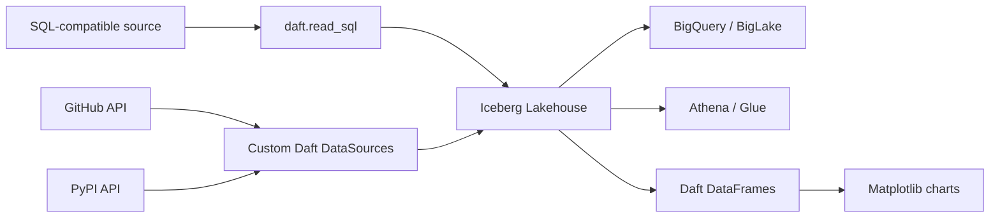

# Lakehouse Analytics Pipeline

Build a complete analytics lakehouse using Daft + Apache Iceberg. Three backends, same code:

| Backend | Env var | Catalog | Warehouse | Bonus |
|---------|---------|---------|-----------|-------|
| **Local** (default) | — | SQLite | `.lakehouse/` | Zero setup |
| **GCS + BigLake** | `GCP_PROJECT` | BigLake REST | GCS bucket | Auto-federated to BigQuery |
| **AWS S3 + Glue** | `AWS_S3_BUCKET` | AWS Glue | S3 bucket | Mount locally via [S3 Files](https://docs.aws.amazon.com/AmazonS3/latest/userguide/s3-files.html) |

This pipeline demonstrates:
- **Custom `DataSource`** implementations for GitHub and PyPI APIs
- **Iceberg catalog** with three interchangeable backends
- **`daft.read_sql()`** for backfilling SQL-compatible data into the lakehouse
- **Direct Daft table operations** via `read_table()`, `where()`, `select()`, and `sort()`
- **Matplotlib** for visualization

## Architecture



## Quick Start

```bash
# Run from the repository root

# Local mode (SQLite Iceberg — no cloud needed)
uv run --extra lakehouse -m pipelines.lakehouse_analytics.ingest

# BigLake mode (GCS + BigQuery)
GCP_PROJECT=eventual-analytics uv run --extra lakehouse -m pipelines.lakehouse_analytics.ingest

# AWS mode (S3 + Glue)
AWS_S3_BUCKET=my-lakehouse uv run --extra lakehouse -m pipelines.lakehouse_analytics.ingest

# Backfill SQL-compatible data into the lakehouse
uv run --extra lakehouse -m pipelines.lakehouse_analytics.backfill \
  --source-url sqlite:///source.db \
  --source-table events \
  --target-table events \
  --key id \
  --target-namespace analytics

# Query and visualize
uv run --extra lakehouse -m pipelines.lakehouse_analytics.analyze
GCP_PROJECT=eventual-analytics uv run --extra lakehouse -m pipelines.lakehouse_analytics.analyze
AWS_S3_BUCKET=my-lakehouse uv run --extra lakehouse -m pipelines.lakehouse_analytics.analyze
```

Local mode writes its Iceberg catalog to `./.lakehouse/` at the repository root by default. Override it with `LAKEHOUSE_DIR` if needed. Local lakehouse data is gitignored.

Copy `.env.example` to `.env` for a complete list of supported environment variables:

```bash
cp .env.example .env
```

| Variable | Purpose | Default |
|----------|---------|---------|
| `GCP_PROJECT` | Enables BigLake mode and sets the Google Cloud project. | unset |
| `GCS_BUCKET` | GCS warehouse bucket for BigLake mode. | `daft-lakehouse` |
| `AWS_S3_BUCKET` | Enables AWS Glue mode with this S3 bucket as warehouse. | unset |
| `AWS_REGION` | AWS region for the Glue catalog and S3 bucket. | `us-east-1` |
| `LAKEHOUSE_NAMESPACE` | Default Iceberg namespace for ingest and analyze. | `analytics` |
| `LAKEHOUSE_DIR` | Local SQLite Iceberg catalog directory. | `.lakehouse` |
| `BACKFILL_SOURCE_URL` | SQLAlchemy source URL for generic SQL backfill. | unset |
| `BACKFILL_QUERY` | SQL query to read from the source. Mutually exclusive with `BACKFILL_SOURCE_TABLE`. | unset |
| `BACKFILL_SOURCE_TABLE` | Source table for `SELECT *` reads. Mutually exclusive with `BACKFILL_QUERY`. | unset |
| `BACKFILL_TARGET_TABLE` | Target Iceberg table for backfill output. | unset |
| `BACKFILL_KEY` | Comma-separated upsert key columns. | unset |
| `BACKFILL_TARGET_NAMESPACE` | Target Iceberg namespace for backfill. | `analytics` |

## SQL Backfill

`backfill.py` reads from any SQLAlchemy-compatible source with `daft.read_sql()` and upserts into the active Iceberg catalog session.

```bash
# Query-based source
uv run --extra lakehouse -m pipelines.lakehouse_analytics.backfill \
  --source-url bigquery://eventual-analytics \
  --query "SELECT * FROM github_daft_stargazers.stargazers" \
  --target-table github_stargazers \
  --key _dlt_id \
  --target-namespace analytics

# Table-based source
uv run --extra lakehouse -m pipelines.lakehouse_analytics.backfill \
  --source-url sqlite:///source.db \
  --source-table events \
  --target-table events \
  --key id
```

The same values can be supplied through `BACKFILL_SOURCE_URL`, `BACKFILL_QUERY`, `BACKFILL_SOURCE_TABLE`, `BACKFILL_TARGET_TABLE`, `BACKFILL_KEY`, and `BACKFILL_TARGET_NAMESPACE`.

## Setup (BigLake mode)

```bash
# 1. Create GCS bucket
gcloud storage buckets create gs://my-lakehouse --location=us-west1 --uniform-bucket-level-access

# 2. Enable APIs
gcloud services enable biglake.googleapis.com bigquery.googleapis.com bigqueryconnection.googleapis.com

# 3. Create BigLake catalog + namespace
gcloud biglake iceberg catalogs create my-lakehouse --catalog-type=gcs-bucket --credential-mode=end-user
gcloud biglake iceberg namespaces create analytics --catalog=my-lakehouse

# 4. Auth
gcloud auth application-default login

# 5. Run
GCP_PROJECT=my-project GCS_BUCKET=my-lakehouse uv run --extra lakehouse -m pipelines.lakehouse_analytics.ingest
```

## Setup (AWS S3 + Glue mode)

```bash
# 1. Create S3 bucket with versioning (required for S3 Files)
aws s3 mb s3://my-lakehouse --region us-east-1
aws s3api put-bucket-versioning --bucket my-lakehouse --versioning-configuration Status=Enabled

# 2. Create Glue database
aws glue create-database --database-input '{"Name": "analytics"}' --region us-east-1

# 3. Run (uses default AWS credentials from env or ~/.aws/credentials)
AWS_S3_BUCKET=my-lakehouse uv run --extra lakehouse -m pipelines.lakehouse_analytics.ingest
```

### Optional: mount with S3 Files for local access

Once your lakehouse is on S3, mount it locally for POSIX access. Agents and
scripts write to the mount; Daft reads via the Glue catalog with full
Iceberg semantics (partition pruning, filter pushdown, schema evolution).

```bash
# Install client
sudo yum -y install amazon-efs-utils  # Amazon Linux
# or: curl https://amazon-efs-utils.aws.com/efs-utils-installer.sh | sudo sh -s -- --install

# Create file system + mount target
aws s3files create-file-system --region us-east-1 --bucket arn:aws:s3:::my-lakehouse --role-arn <role-arn>
aws s3files create-mount-target --region us-east-1 --file-system-id <fs-id> --subnet-id <subnet-id>

# Mount
sudo mkdir /mnt/lakehouse
sudo mount -t s3files <fs-id>:/ /mnt/lakehouse

# Now your Iceberg data is at /mnt/lakehouse/ AND s3://my-lakehouse/
ls /mnt/lakehouse/analytics/
```

See the [S3 Files documentation](https://docs.aws.amazon.com/AmazonS3/latest/userguide/s3-files.html) for IAM policies and security group configuration.

## Files

| File | Purpose |
|------|---------|
| `pipelines/catalog.py` | Shared session factory |
| `sources.py` | Custom `DataSource` implementations (GitHub, PyPI) |
| `ingest.py` | Run all sources, upsert into Iceberg tables |
| `backfill.py` | Backfill SQL-compatible data into the lakehouse |
| `analyze.py` | Read Iceberg tables with Daft, visualize with matplotlib |

## Notes

- Run this pipeline as a module with `uv run --extra lakehouse -m ...`
- Shared helpers live under `pipelines/`; no `sys.path` mutation is required
