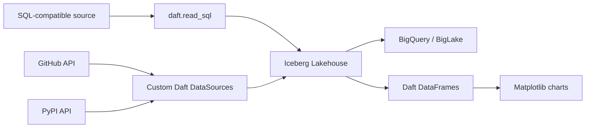

# Lakehouse Analytics Pipeline

Build a complete analytics lakehouse using Daft + Apache Iceberg. Three backends, same code:

| Backend | Env var | Catalog | Warehouse | Bonus |
|---------|---------|---------|-----------|-------|
| **Local** (default) | — | SQLite | `.lakehouse/` | Zero setup |
| **GCS + BigLake** | `GCP_PROJECT` | BigLake REST | GCS bucket | Auto-federated to BigQuery |
| **AWS S3 + Glue** | `AWS_S3_BUCKET` | AWS Glue | S3 bucket | Mount locally via [S3 Files](https://docs.aws.amazon.com/AmazonS3/latest/userguide/s3-files.html) |

This pipeline demonstrates:
- **Custom `DataSource`** implementations for GitHub and PyPI APIs
- **Iceberg catalog** with three interchangeable backends
- **`daft.read_sql()`** for backfilling SQL-compatible data into the lakehouse
- **Direct Daft table operations** via `read_table()`, `where()`, `select()`, and `sort()`
- **Matplotlib** for visualization

## Architecture



## Quick Start

```bash
# Run from the repository root

# Local mode (SQLite Iceberg — no cloud needed)
uv run --extra lakehouse -m pipelines.lakehouse_analytics.ingest

# BigLake mode (GCS + BigQuery)
GCP_PROJECT=eventual-analytics uv run --extra lakehouse -m pipelines.lakehouse_analytics.ingest

# AWS mode (S3 + Glue)
AWS_S3_BUCKET=my-lakehouse uv run --extra lakehouse -m pipelines.lakehouse_analytics.ingest

# Backfill SQL-compatible data into the lakehouse
uv run --extra lakehouse -m pipelines.lakehouse_analytics.backfill \
  --source-url sqlite:///source.db \
  --source-table events \
  --target-table events \
  --key id \
  --target-namespace analytics

# Query and visualize
uv run --extra lakehouse -m pipelines.lakehouse_analytics.analyze
GCP_PROJECT=eventual-analytics uv run --extra lakehouse -m pipelines.lakehouse_analytics.analyze
AWS_S3_BUCKET=my-lakehouse uv run --extra lakehouse -m pipelines.lakehouse_analytics.analyze
```

Local mode writes its Iceberg catalog to `./.lakehouse/` at the repository root by default. Override it with `LAKEHOUSE_DIR` if needed. Local lakehouse data is gitignored.

Copy `.env.example` to `.env` for a complete list of supported environment variables:

```bash
cp .env.example .env
```

| Variable | Purpose | Default |
|----------|---------|---------|
| `GCP_PROJECT` | Enables BigLake mode and sets the Google Cloud project. | unset |
| `GCS_BUCKET` | GCS warehouse bucket for BigLake mode. | `daft-lakehouse` |
| `AWS_S3_BUCKET` | Enables AWS Glue mode with this S3 bucket as warehouse. | unset |
| `AWS_REGION` | AWS region for the Glue catalog and S3 bucket. | `us-east-1` |
| `LAKEHOUSE_NAMESPACE` | Default Iceberg namespace for ingest and analyze. | `analytics` |
| `LAKEHOUSE_DIR` | Local SQLite Iceberg catalog directory. | `.lakehouse` |
| `BACKFILL_SOURCE_URL` | SQLAlchemy source URL for generic SQL backfill. | unset |
| `BACKFILL_QUERY` | SQL query to read from the source. Mutually exclusive with `BACKFILL_SOURCE_TABLE`. | unset |
| `BACKFILL_SOURCE_TABLE` | Source table for `SELECT *` reads. Mutually exclusive with `BACKFILL_QUERY`. | unset |
| `BACKFILL_TARGET_TABLE` | Target Iceberg table for backfill output. | unset |
| `BACKFILL_KEY` | Comma-separated upsert key columns. | unset |
| `BACKFILL_TARGET_NAMESPACE` | Target Iceberg namespace for backfill. | `analytics` |

## SQL Backfill

`backfill.py` reads from any SQLAlchemy-compatible source with `daft.read_sql()` and upserts into the active Iceberg catalog session.

```bash
# Query-based source
uv run --extra lakehouse -m pipelines.lakehouse_analytics.backfill \
  --source-url bigquery://eventual-analytics \
  --query "SELECT * FROM github_daft_stargazers.stargazers" \
  --target-table github_stargazers \
  --key _dlt_id \
  --target-namespace analytics

# Table-based source
uv run --extra lakehouse -m pipelines.lakehouse_analytics.backfill \
  --source-url sqlite:///source.db \
  --source-table events \
  --target-table events \
  --key id
```

The same values can be supplied through `BACKFILL_SOURCE_URL`, `BACKFILL_QUERY`, `BACKFILL_SOURCE_TABLE`, `BACKFILL_TARGET_TABLE`, `BACKFILL_KEY`, and `BACKFILL_TARGET_NAMESPACE`.

## Setup (BigLake mode)

```bash
# 1. Create GCS bucket
gcloud storage buckets create gs://my-lakehouse --location=us-west1 --uniform-bucket-level-access

# 2. Enable APIs
gcloud services enable biglake.googleapis.com bigquery.googleapis.com bigqueryconnection.googleapis.com

# 3. Create BigLake catalog + namespace
gcloud biglake iceberg catalogs create my-lakehouse --catalog-type=gcs-bucket --credential-mode=end-user
gcloud biglake iceberg namespaces create analytics --catalog=my-lakehouse

# 4. Auth
gcloud auth application-default login

# 5. Run
GCP_PROJECT=my-project GCS_BUCKET=my-lakehouse uv run --extra lakehouse -m pipelines.lakehouse_analytics.ingest
```

## Setup (AWS S3 + Glue mode)

```bash
# 1. Create S3 bucket with versioning (required for S3 Files)
aws s3 mb s3://my-lakehouse --region us-east-1
aws s3api put-bucket-versioning --bucket my-lakehouse --versioning-configuration Status=Enabled

# 2. Create Glue database
aws glue create-database --database-input '{"Name": "analytics"}' --region us-east-1

# 3. Run (uses default AWS credentials from env or ~/.aws/credentials)
AWS_S3_BUCKET=my-lakehouse uv run --extra lakehouse -m pipelines.lakehouse_analytics.ingest
```

### Optional: mount with S3 Files for local access

Once your lakehouse is on S3, mount the bucket as a local filesystem. Agents
and scripts write to `/mnt/lakehouse/` with POSIX semantics; Daft reads via
the Glue catalog with full Iceberg semantics (partition pruning, filter
pushdown, schema evolution). One bucket, one source of truth.

This walkthrough is end-to-end: replace `my-lakehouse`, `123456789012`,
`us-east-1`, and the subnet/security group IDs with your own values.

#### Prerequisites

S3 Files has strict bucket requirements. Verify these before continuing:

- General-purpose bucket (not directory bucket)
- Versioning **enabled** (required for sync)
- SSE-S3 or SSE-KMS encryption (no SSE-C)
- EC2 instance in the same region as the bucket
- `amazon-efs-utils` v3.0.0+ on the EC2 instance

```bash
# Verify bucket meets requirements
aws s3api get-bucket-versioning --bucket my-lakehouse
aws s3api get-bucket-encryption --bucket my-lakehouse
```

#### Step 1: install the S3 Files client on your EC2 instance

```bash
# Amazon Linux 2 / 2023
sudo yum -y install amazon-efs-utils

# Other distros
curl https://amazon-efs-utils.aws.com/efs-utils-installer.sh | sudo sh -s -- --install

# Verify version (must be >=3.0.0)
mount.s3files --version
```

#### Step 2: create the S3 Files service role

S3 Files needs an IAM role it can assume to read and write your bucket on
your behalf. Save the trust policy and inline policy as JSON files first.

`s3files-trust-policy.json`:

```json
{
  "Version": "2012-10-17",
  "Statement": [{
    "Effect": "Allow",
    "Principal": { "Service": "elasticfilesystem.amazonaws.com" },
    "Action": "sts:AssumeRole",
    "Condition": {
      "StringEquals": { "aws:SourceAccount": "123456789012" },
      "ArnLike": { "aws:SourceArn": "arn:aws:s3files:us-east-1:123456789012:file-system/*" }
    }
  }]
}
```

`s3files-bucket-policy.json`:

```json
{
  "Version": "2012-10-17",
  "Statement": [
    {
      "Effect": "Allow",
      "Action": ["s3:ListBucket", "s3:ListBucketVersions"],
      "Resource": "arn:aws:s3:::my-lakehouse"
    },
    {
      "Effect": "Allow",
      "Action": [
        "s3:AbortMultipartUpload",
        "s3:DeleteObject*",
        "s3:GetObject*",
        "s3:List*",
        "s3:PutObject*"
      ],
      "Resource": "arn:aws:s3:::my-lakehouse/*"
    }
  ]
}
```

Then create the role:

```bash
aws iam create-role \
  --role-name S3FilesServiceRole \
  --assume-role-policy-document file://s3files-trust-policy.json

aws iam put-role-policy \
  --role-name S3FilesServiceRole \
  --policy-name S3FilesBucketAccess \
  --policy-document file://s3files-bucket-policy.json
```

#### Step 3: attach the client policy to your EC2 instance role

The EC2 instance needs permission to mount the file system. Attach the
managed policy to whichever IAM role is on your instance profile.

```bash
aws iam attach-role-policy \
  --role-name <your-ec2-instance-role> \
  --policy-arn arn:aws:iam::aws:policy/AmazonS3FilesClientFullAccess
```

Use `AmazonS3FilesClientReadOnlyAccess` instead if the instance should only
read the lakehouse.

#### Step 4: open NFS traffic between EC2 and the mount target

S3 Files uses NFS over TCP port 2049. Create a dedicated security group for
the mount target and authorize traffic from your EC2 instance's security
group.

```bash
# Create a security group for the mount target
aws ec2 create-security-group \
  --group-name s3files-mount-target \
  --description "S3 Files NFS access" \
  --vpc-id <your-vpc-id>
# returns the new sg-xxxxx ID

# Allow NFS from the EC2 instance's security group
aws ec2 authorize-security-group-ingress \
  --group-id <mount-target-sg-id> \
  --protocol tcp --port 2049 \
  --source-group <ec2-instance-sg-id>

# Allow outbound NFS from the EC2 instance to the mount target
aws ec2 authorize-security-group-egress \
  --group-id <ec2-instance-sg-id> \
  --protocol tcp --port 2049 \
  --source-group <mount-target-sg-id>
```

#### Step 5: create the file system

```bash
aws s3files create-file-system \
  --region us-east-1 \
  --bucket arn:aws:s3:::my-lakehouse \
  --role-arn arn:aws:iam::123456789012:role/S3FilesServiceRole
```

The response includes a `FileSystemId` (e.g. `fs-0123456789abcdef0`). Save
it. Creation finishes in a few minutes — poll with `aws s3files get-file-system --file-system-id <id>` until `LifecycleState: AVAILABLE`.

#### Step 6: create a mount target

One mount target per Availability Zone. Use a subnet in the same VPC and AZ
as your EC2 instance.

```bash
aws s3files create-mount-target \
  --region us-east-1 \
  --file-system-id fs-0123456789abcdef0 \
  --subnet-id subnet-abc123 \
  --security-groups <mount-target-sg-id>
```

Mount targets take up to ~5 minutes. Poll with
`aws s3files describe-mount-targets --file-system-id <id>` until
`LifecycleState: AVAILABLE`.

#### Step 7: mount on the EC2 instance

```bash
sudo mkdir -p /mnt/lakehouse
sudo mount -t s3files fs-0123456789abcdef0:/ /mnt/lakehouse

# Verify
ls /mnt/lakehouse/
mount | grep s3files
```

#### Step 8: persist the mount across reboots (optional)

Add an `/etc/fstab` entry so the mount comes back after reboot:

```
fs-0123456789abcdef0:/ /mnt/lakehouse s3files _netdev,noresvport 0 0
```

#### Step 9: verify dual access

Confirm your data is accessible through both paths:

```bash
# Write via the mount (POSIX)
echo "hello s3 files" > /mnt/lakehouse/test.txt

# Read via the S3 API (within ~60s, after sync)
aws s3 cp s3://my-lakehouse/test.txt -

# Or read with Daft
python -c "
import daft
from daft.functions import file as daft_file
df = (daft.from_glob_path('s3://my-lakehouse/test.txt')
        .with_column('file', daft_file(daft.col('path'))))
df.show()
"
```

#### Troubleshooting

| Symptom | Likely cause |
|---------|--------------|
| `mount.s3files: command not found` | `amazon-efs-utils` not installed or older than 3.0.0 |
| `mount.nfs4: Connection timed out` | Security group doesn't allow TCP 2049 between EC2 and mount target |
| `mount.s3files: access denied` | EC2 instance role missing `AmazonS3FilesClientFullAccess` |
| `LifecycleState: ERROR` on file system | Bucket missing versioning, encryption, or service role can't assume |
| Files written to mount don't appear in S3 | Wait up to 60s — write batching aggregates changes before pushing to S3 |
| `.s3files-lost+found-*/` directory appears | Conflicting writes between mount and S3 API; S3 wins, your local change went to lost+found |

For the full reference, see the [S3 Files documentation](https://docs.aws.amazon.com/AmazonS3/latest/userguide/s3-files.html).

## Files

| File | Purpose |
|------|---------|
| `pipelines/catalog.py` | Shared session factory |
| `sources.py` | Custom `DataSource` implementations (GitHub, PyPI) |
| `ingest.py` | Run all sources, upsert into Iceberg tables |
| `backfill.py` | Backfill SQL-compatible data into the lakehouse |
| `analyze.py` | Read Iceberg tables with Daft, visualize with matplotlib |

## Notes

- Run this pipeline as a module with `uv run --extra lakehouse -m ...`
- Shared helpers live under `pipelines/`; no `sys.path` mutation is required
